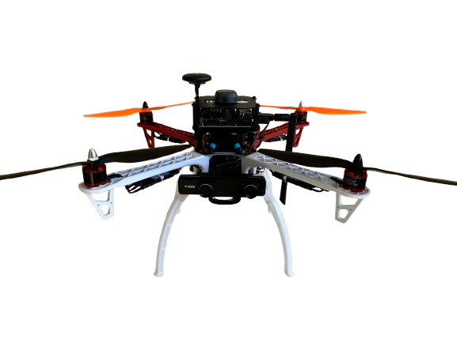

# **Drone F450 com PX4, ROS2, Jetson Xavier, ZED Mini, UM7 Inertial e RTK Emlid**

Este repositório contém o código e as instruções para configurar e operar um **Drone F450** equipado com **PX4**, **ROS2**, **Jetson Xavier**, **ZED Mini**, **UM7 Inertial** e **RTK Emlid** para realizar **missões autônomas** com **planejamento de trajetória (Path Planning)**. Utilizamos algoritmos de **SLAM** para navegação e mapeamento.

<p align="center">
  
</p>

## Demo do Projeto

[](https://www.youtube.com/watch?v=DD4cZKjU3OE)

Assista ao vídeo acima para ver o projeto em ação na competição SARC Barinet. O propósito é detectar regiões com possíveis macrófitas, plantas aquáticas importantes para ecossistemas de rios.

## **Sumário**

- [Visão Geral](#visão-geral)
- [Componentes Utilizados](#componentes-utilizados)
- [Pré-requisitos](#pré-requisitos)
- [Instalação](#instalação)
  - [Configuração do Docker](#configuração-do-docker)
  - [Configuração do PX4](#configuração-do-px4)
  - [Configuração do ROS2](#configuração-do-ros2)
- [Execução](#execução)
- [SLAM e Planejamento de Trajetória](#slam-e-planejamento-de-trajetória)
- [Contribuições](#contribuições)
- [Licença](#licença)

---

## **Visão Geral**

Este projeto visa criar uma plataforma de drone autônomo utilizando o **Drone F450**. A integração dos diversos sensores e sistemas embarcados permite que o drone execute missões autônomas, empregando algoritmos de **SLAM** para mapeamento e navegação, além de realizar **Path Planning** para evitar obstáculos e otimizar rotas.

O sistema é baseado no **PX4** como controlador de voo e **ROS2** como framework de comunicação para integração dos diversos sensores e algoritmos. A **Jetson Xavier** é usada para processamento pesado, como o processamento de imagens da **ZED Mini** para a geração de mapas em 3D e o algoritmo de SLAM.

<p align="center">
  
</p>

## **Componentes Utilizados**

- **Drone F450 Frame**: Quadro do drone.
- **PX4 Autopilot**: Sistema de piloto automático para controle de voo.
- **ROS2 (Robot Operating System 2)**: Framework para integração de sistemas e sensores.
- **Jetson Xavier**: Computador de bordo para processamento de algoritmos de visão e IA.
- **ZED Mini**: Câmera estereoscópica para mapeamento e navegação em 3D.
- **UM7 Orientation Sensor**: Unidade de Medição Inercial (IMU) para fornecer dados de orientação.
- **RTK Emlid**: Sistema de correção GNSS para navegação de alta precisão.

## **Pré-requisitos**

Antes de começar, certifique-se de que você atendeu aos seguintes requisitos:

- Jetson Xavier com **JetPack** configurado.
- Docker instalado na Jetson Xavier.
- PX4 configurado no drone.
- ROS2 instalado e configurado.
- ZED Mini SDK instalado.
- **UM7 Sensor** conectado e configurado.
- **RTK Emlid** configurado para fornecer dados GNSS de alta precisão.

## **Instalação**

### **Configuração do Docker**

Para rodar o ROS2, PX4 e os pacotes necessários dentro de um container Docker, siga os passos abaixo:

1. **Usando a imagem oficial do Jetson Xavier**:
   ```Dockerfile
   FROM nvcr.io/nvidia/l4t-base:r35.1.0

   # Instalar dependências do ROS 2
   RUN apt-get update && apt-get install -y \
       curl \
       gnupg2 \
       lsb-release \
       software-properties-common \
       build-essential \
       cmake \
       git \
       python3-pip

   # Instalar ROS 2 Humble Hawksbill
   RUN locale-gen en_US en_US.UTF-8 \
       && update-locale LC_ALL=en_US.UTF-8 LANG=en_US.UTF-8 \
       && apt update && apt install -y locales

   # Adicionar o repositório do ROS 2
   RUN curl -sSL https://raw.githubusercontent.com/ros/rosdistro/master/ros.asc | sudo apt-key add - \
       && add-apt-repository http://packages.ros.org/ros2/ubuntu \
       && apt update && apt install -y ros-humble-desktop

   # Configurar ambiente do ROS 2
   SHELL ["/bin/bash", "-c"]
   RUN echo "source /opt/ros/humble/setup.bash" >> ~/.bashrc

   # Instalar PX4
   RUN apt-get install -y python3-colcon-common-extensions
   RUN git clone https://github.com/PX4/PX4-Autopilot.git --recursive
   WORKDIR /PX4-Autopilot
   RUN DONT_RUN=1 make px4_sitl_default

   # Instalar pacotes da ZED Mini
   RUN apt-get install -y ros-humble-zed-ros2-wrapper

   # Instalar pacotes do UM7 Orientation Sensor
   RUN apt-get install -y ros-humble-um7

   # Instalar pacotes para RTK Emlid
   RUN apt-get install -y ros-humble-nmea-navsat-driver

   # Instalar pacotes da câmera RGB Logitech
   RUN apt-get install -y ros-humble-v4l2-camera

   # Configurar entrada de vídeo para a Logitech
   RUN apt-get


