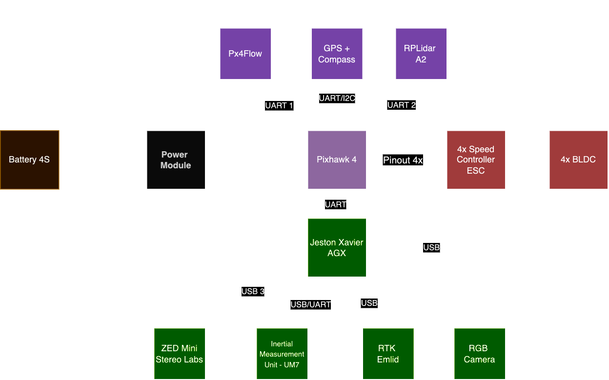

# **Drone F450 com PX4, ROS2, Jetson Xavier, ZED Mini, UM7 Inertial e RTK Emlid**

Este repositório contém o código e as instruções para configurar e operar um **Drone F450** equipado com **PX4**, **ROS2**, **Jetson Xavier**, **ZED Mini**, **UM7 Inertial** e **RTK Emlid** para realizar **missões autônomas** com **planejamento de trajetória (Path Planning)**. Utilizamos algoritmos de **SLAM** para navegação e mapeamento.

<p align="center">
  
</p>

## Demo do Projeto

<p align="center">
  <a href="https://youtu.be/DD4cZKjU3OE?si=M-d3tPuX8iqx91zh&t=67">
    
  </a>
  <a href="https://youtu.be/DD4cZKjU3OE?si=M-d3tPuX8iqx91zh&t=67">
    
  </a>
</p>

Assista ao vídeo acima para ver o projeto em ação na competição SARC Barinet. O propósito é detectar regiões com possíveis macrófitas, plantas aquáticas importantes para ecossistemas de rios.

## **Sumário**

- [Visão Geral](#visão-geral)
- [Componentes Utilizados](#componentes-utilizados)
- [Pré-requisitos](#pré-requisitos)
- [Instalação](#instalação)
  - [Configuração do Docker](#configuração-do-docker)
  - [Configuração do PX4](#configuração-do-px4)
  - [Configuração do ROS2](#configuração-do-ros2)
- [Execução](#execução)
- [SLAM e Planejamento de Trajetória](#slam-e-planejamento-de-trajetória)
- [Contribuições](#contribuições)
- [Licença](#licença)

---

## **Visão Geral**

Este projeto visa criar uma plataforma de drone autônomo utilizando o **Drone F450**. A integração dos diversos sensores e sistemas embarcados permite que o drone execute missões autônomas, empregando algoritmos de **SLAM** para mapeamento e navegação, além de realizar **Path Planning** para evitar obstáculos e otimizar rotas.

O sistema é baseado no **PX4** como controlador de voo e **ROS2** como framework de comunicação para integração dos diversos sensores e algoritmos. A **Jetson Xavier** é usada para processamento pesado, como o processamento de imagens da **ZED Mini** para a geração de mapas em 3D e o algoritmo de SLAM.

<p align="center">
  
</p>

## **Componentes Utilizados**

- **Drone F450 Frame**: Quadro do drone.
- **Pixhawk 4**: Sistema de piloto automático para controle de voo.
- **ROS2 (Robot Operating System 2)**: Framework para integração de sistemas e sensores.
- **Jetson Xavier**: Computador de bordo para processamento de algoritmos de visão e IA.
- **ZED Mini**: Câmera estereoscópica para mapeamento e navegação em 3D.
- **UM7 Orientation Sensor**: Unidade de Medição Inercial (IMU) para fornecer dados de orientação.
- **RTK Emlid**: Sistema de correção GNSS para navegação de alta precisão.

## **Pré-requisitos**

Antes de começar, certifique-se de que você atendeu aos seguintes requisitos:

- Jetson Xavier com **JetPack** configurado.
- Docker instalado na Jetson Xavier.
- PX4 configurado no drone.
- ROS2 instalado e configurado.
- ZED Mini SDK instalado.
- **UM7 Sensor** conectado e configurado.
- **RTK Emlid** configurado para fornecer dados GNSS de alta precisão.

## **Instalação**

### Construa a imagem Docker para PX4 e ROS2:

```bash
docker build -t px4_ros2_jetson .
```

### Execute o container:

```bash
docker run -it --privileged px4_ros2_jetson /bin/bash
```

### Configuração do PX4

Compile o código PX4:

```bash
make px4_fmu-v5_default
```

Configure o PX4 para comunicação com o ROS2. Certifique-se de que o MAVROS está configurado corretamente para se comunicar com o PX4:

```bash
sudo apt install ros-humble-mavros ros-humble-mavros-extras
```

Configurar o drone no QGroundControl para iniciar as missões.

### Configuração do ROS2

Instale os pacotes ROS2 necessários:

```bash
sudo apt update
sudo apt install ros-humble-desktop
```

### Pacotes para ZED Mini:

Instale o SDK da ZED Mini e o wrapper para ROS2:

```bash
wget https://stereolabs.sfo2.digitaloceanspaces.com/zedsdk/3.5/jetson_jp45/zedsdk_3.5.0_jp45_jetson.run
chmod +x zedsdk_3.5.0_jp45_jetson.run
./zedsdk_3.5.0_jp45_jetson.run
```

### Conectar o UM7 e RTK Emlid:

Certifique-se de que o UM7 e o RTK Emlid estão devidamente conectados e que os drivers estão configurados.

## **Execução**

1. Inicie o ROS2 e configure os nodes necessários:

    ```bash
    source /opt/ros/humble/setup.bash
    ros2 launch px4_ros_com sensor_combined.launch.py
    ```

2. Inicialize o PX4:

    ```bash
    ros2 run px4_ros_com px4.launch.py
    ```

3. Execute os nodes de navegação e sensores como ZED Mini, UM7 e RTK:

    ```bash
    ros2 launch zed_wrapper zed.launch.py
    ros2 launch um7_driver um7.launch.py
    ros2 launch emlid_rtk_driver rtk.launch.py
    ```

## **SLAM e Planejamento de Trajetória**

Para navegação autônoma, usamos algoritmos de SLAM (Simultaneous Localization and Mapping) para mapear o ambiente e localizar o drone no espaço.

- **SLAM com ZED Mini**: Utilizamos o ZED Mini para captura de imagens em 3D e geração de mapas 3D em tempo real.

- **Planejamento de Trajetória (Path Planning)**: Algoritmos de planejamento de trajetória foram implementados para permitir ao drone evitar obstáculos e seguir rotas otimizadas durante as missões autônomas.

Os principais pacotes usados são:

- rtabmap_ros para SLAM.
- move_base para planejamento de caminho.

## **Contribuições**

Contribuições são bem-vindas! Sinta-se à vontade para fazer um fork deste repositório e submeter pull requests com melhorias ou correções.

1. Faça o fork do projeto.
2. Crie um branch para sua feature (`git checkout -b feature/MinhaFeature`).
3. Adicione suas modificações (`git add .`).
4. Faça o commit (`git commit -m 'Adicionando MinhaFeature'`).
5. Envie para o branch (`git push origin feature/MinhaFeature`).
6. Crie um Pull Request.

## **Licença**

Este projeto está licenciado sob a Licença MIT - veja o arquivo LICENSE para mais detalhes.
